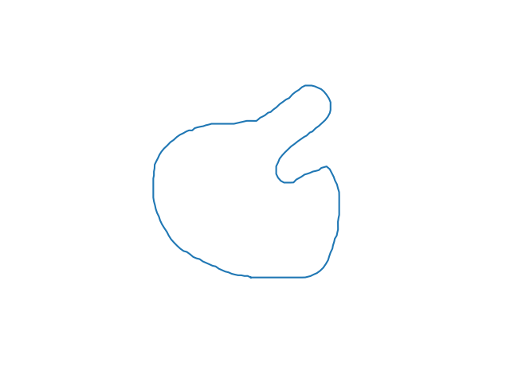

Just pass the two binary images and the PLY mesh filename output as parameters. Example:

    python3 curve_interpolator.py -i samples/1.png -e samples/4.png -o /tmp/manolo.ply -n 120 -c 200

*-i* and *-e* indicates the first and the last curve, *-n* indicates the number of curves to be interpolated and *-c* indicates the number of points to each curve.

You can also generates a gif file with the animation of the first curve morphing to the last curve. Above a sample of a generated gif file:

